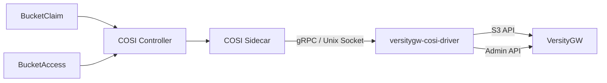

# VersityGW COSI Driver

[](https://github.com/isac322/versitygw-cosi-driver/actions/workflows/ci.yaml)
[](https://pkg.go.dev/github.com/isac322/versitygw-cosi-driver)
[](https://goreportcard.com/report/github.com/isac322/versitygw-cosi-driver)
[](LICENSE)
[](https://github.com/isac322/versitygw-cosi-driver/releases)

[COSI](https://github.com/kubernetes-sigs/container-object-storage-interface-spec) (Container Object Storage Interface) is the Kubernetes-native way to manage object storage. It defines custom resources (`BucketClaim`, `BucketAccess`) that let you create S3 buckets and provision scoped credentials through plain YAML, the same way you'd use a `PersistentVolumeClaim` for block storage.

This driver implements COSI for [VersityGW](https://github.com/versity/versitygw), an open-source S3-compatible gateway that can front POSIX filesystems, Ceph, and other backends. If you're running VersityGW and want to manage buckets and per-app credentials through Kubernetes CRs instead of scripts or Terraform, this is the glue.

> **Status**: Alpha. Works and is tested, but COSI itself is at `v1alpha1`. Expect breaking changes between minor versions.

## What it does

Apply a `BucketClaim` CR, and the driver creates the bucket on VersityGW. Apply a `BucketAccess` CR, and it creates a dedicated IAM user with a scoped bucket policy, then drops the credentials into a Secret. Delete the CRs, and everything gets cleaned up.

Multiple apps can share a bucket with independent access. Revoking one app's access doesn't affect others.

The driver talks to VersityGW over two APIs: the standard S3 API for bucket operations, and the VersityGW Admin API for user and policy management.

## Compatibility

| Component | Versions |
|-----------|----------|
| Kubernetes | 1.25+ (COSI requires 1.25) |
| COSI Controller | v0.2.x |
| VersityGW | 0.x (IAM and Admin API must be enabled) |
| Helm | 3.x |

## Quick Start

You need a running VersityGW instance with IAM enabled (`--iam-dir`) and the Admin API enabled (`--admin-port`). The driver needs network access to both endpoints from inside the cluster.

### 1. Install the COSI Controller

```bash
kubectl create -k 'https://github.com/kubernetes-sigs/container-object-storage-interface//?ref=v0.2.2'
```

### 2. Create Admin Credentials Secret

```bash
kubectl create secret generic versitygw-root-credentials \
  --from-literal=rootAccessKeyId=YOUR_ACCESS_KEY \
  --from-literal=rootSecretAccessKey=YOUR_SECRET_KEY
```

### 3. Install the Driver

#### Helm

```bash
helm install versitygw-cosi-driver \
  oci://ghcr.io/isac322/charts/versitygw-cosi-driver \
  --set driver.name=versitygw.cosi.dev \
  --set versitygw.credentials.secretName=versitygw-root-credentials
```

#### Kustomize

```bash
kubectl apply -k 'https://github.com/isac322/versitygw-cosi-driver/deploy/kustomize/default/?ref=app-v0.3.0'
```

### 4. Create a Bucket

```yaml
apiVersion: objectstorage.k8s.io/v1alpha1
kind: BucketClaim
metadata:
  name: my-bucket
  namespace: default
spec:
  bucketClassName: versitygw
  protocols:
    - s3
```

```bash
$ kubectl get bucketclaim my-bucket
NAME        BUCKET CLASS   BUCKET READY   AGE
my-bucket   versitygw      true           30s
```

### 5. Get Credentials

```yaml
apiVersion: objectstorage.k8s.io/v1alpha1
kind: BucketAccess
metadata:
  name: my-bucket-access
  namespace: default
spec:
  bucketClaimName: my-bucket
  bucketAccessClassName: versitygw
  credentialsSecretName: my-bucket-credentials
  protocol: s3
```

This creates an IAM user on VersityGW, attaches a bucket policy, and writes the credentials to a Secret:

```bash
$ kubectl get secret my-bucket-credentials -o jsonpath='{.data}' | jq 'map_values(@base64d)'
{
  "accessKeyID": "ba-a1b2c3d4",
  "accessSecretKey": "...",
  "endpoint": "http://versitygw:7070",
  "region": "us-east-1"
}
```

Your app can mount this Secret and talk to VersityGW directly.

## Configuration

### Helm Values

Key parameters are listed below. See [`values.yaml`](deploy/helm/versitygw-cosi-driver/values.yaml) for the full list, including `securityContext`, `serviceAccount`, `nodeSelector`, `tolerations`, and `affinity`.

| Parameter | Description | Default |
|-----------|-------------|---------|
| `driver.name` | COSI driver name (required) | `""` |
| `versitygw.s3Endpoint` | VersityGW S3 API endpoint | derived from `serviceName` |
| `versitygw.adminEndpoint` | VersityGW Admin API endpoint | derived from `serviceName` |
| `versitygw.region` | S3 region | `us-east-1` |
| `versitygw.credentials.secretName` | Admin credentials Secret name | `versitygw-root-credentials` |
| `driver.image.repository` | Driver container image | `ghcr.io/isac322/versitygw-cosi-driver` |
| `driver.image.tag` | Image tag (defaults to chart appVersion) | `""` |
| `sidecar.extraArgs` | Extra arguments for COSI sidecar (e.g. `["--v=5"]`) | `[]` |
| `bucketClass.create` | Create a default BucketClass | `true` |
| `bucketAccessClass.create` | Create a default BucketAccessClass | `true` |

### Environment Variables

| Variable | Description |
|----------|-------------|
| `DRIVER_NAME` | COSI driver name (required) |
| `VERSITYGW_S3_ENDPOINT` | VersityGW S3 API endpoint URL |
| `VERSITYGW_ADMIN_ENDPOINT` | VersityGW Admin API endpoint URL |
| `VERSITYGW_ADMIN_ACCESS` | Admin access key |
| `VERSITYGW_ADMIN_SECRET` | Admin secret key |
| `VERSITYGW_REGION` | S3 region (default: `us-east-1`) |

## Architecture



The driver runs as a Deployment with two containers: the driver itself (implements the COSI gRPC `Provisioner` and `Identity` services) and the standard [objectstorage-sidecar](https://github.com/kubernetes-sigs/container-object-storage-interface) that bridges Kubernetes CRs to gRPC calls. They communicate over a shared Unix socket.

When you create a `BucketClaim`, the COSI controller dispatches to the sidecar, which calls `DriverCreateBucket` on the driver. The driver validates the name and creates the bucket on VersityGW via S3 API.

When you create a `BucketAccess`, the same path calls `DriverGrantBucketAccess`. The driver creates an IAM user via the Admin API, attaches a bucket policy granting that user access, and returns the credentials to Kubernetes.

## How does this compare to other approaches?

**Terraform / Crossplane / ACK** can manage S3 buckets, but they're general-purpose tools with their own state management. COSI is purpose-built for object storage in Kubernetes and handles the full lifecycle (bucket + credentials + cleanup) through CRs that feel native.

**Other COSI drivers** exist for different storage backends:

| Project | Storage Backend |
|---------|----------------|
| [cosi-driver-sample](https://github.com/kubernetes-sigs/cosi-driver-sample) | None (reference implementation) |
| [Scality COSI driver](https://github.com/scality/cosi-driver) | Scality RING / ARTESCA |
| [Rook Ceph COSI](https://rook.io/docs/rook/latest/Storage-Configuration/Object-Storage-RGW/cosi/) | Ceph RGW |
| **versitygw-cosi-driver** | [VersityGW](https://github.com/versity/versitygw) |

## Troubleshooting

**BucketClaim stays pending:**
Check that the COSI controller is running (`kubectl get pods -A | grep objectstorage`), check driver logs (`kubectl logs deploy/versitygw-cosi-driver -c driver`), and make sure VersityGW is reachable from the cluster.

**"XAdminMethodNotSupported" error:**
VersityGW needs IAM enabled. Pass `--iam-dir` when starting VersityGW, or set `iam.enabled=true` in the VersityGW Helm chart.

**Access denied after granting:**
Make sure the admin credentials Secret exists with valid keys, and that the admin account has permission to create users and set bucket policies.

## Contributing

See [CONTRIBUTING.md](CONTRIBUTING.md) for development setup, testing, and PR guidelines.

## Related Projects

- [VersityGW](https://github.com/versity/versitygw) - S3-compatible gateway for POSIX, Ceph, and other backends
- [COSI Specification](https://github.com/kubernetes-sigs/container-object-storage-interface-spec) - Container Object Storage Interface spec
- [COSI Controller](https://github.com/kubernetes-sigs/container-object-storage-interface) - Reference COSI controller

## Adopters

Using versitygw-cosi-driver? [Open a PR](https://github.com/isac322/versitygw-cosi-driver/pulls) to add your organization here.

## License

[MIT](LICENSE)
